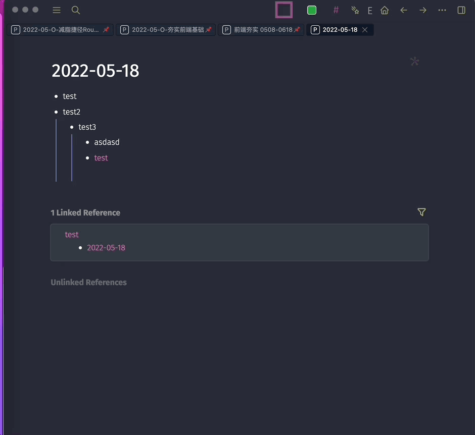

# Logseq Plugin Page Export

> a plugin that makes use of [html2canvas](https://html2canvas.hertzen.com/) to export current page in logseq

## About this plugin


## How to use
1. click `icon` in toolbar
2. wait for preview img ready (usually it takes 5-10s)
3. save to disk

## Contribute

1.  ```shell
    pnpm i
    npm run dev
    ```
2.  open logseq(dev mode) load unpacked plugin

## Plugin Template

> https://github.com/pengx17/logseq-plugin-template-react

### Feature

- plug & play boilerplate with properly defined GitHub action defaults
- develop with HMR, empowered by lightning fast Vite ⚡ with [vite-logseq-plugin](https://github.com/pengx17/vite-plugin-logseq)
- windicss for styling
- pnpm
